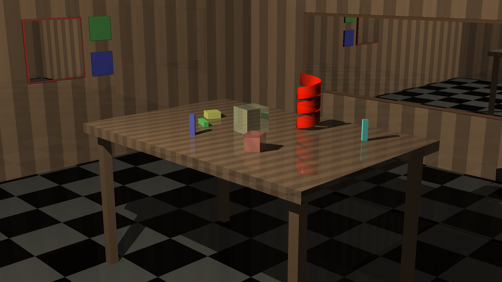
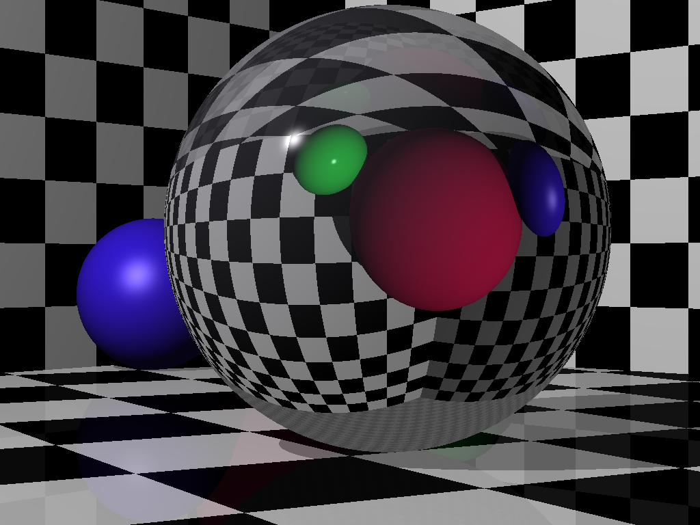
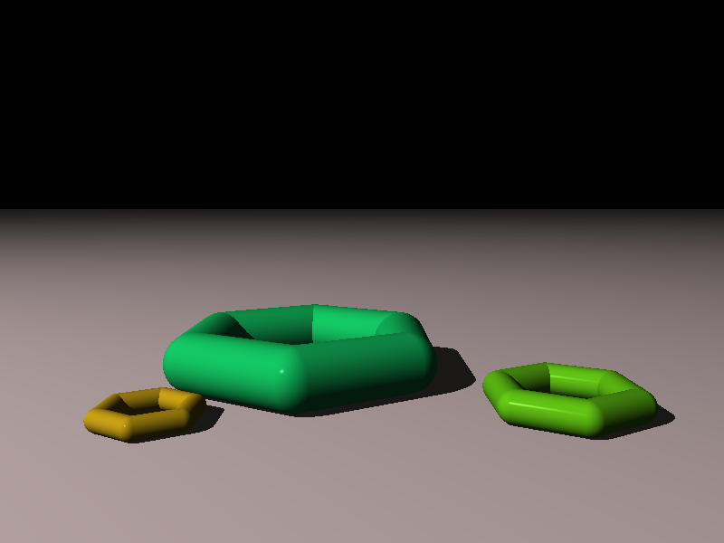

# The Raytracer Challenge in Scala
[The Raytracer Challenge](https://pragprog.com/book/jbtracer/the-ray-tracer-challenge) book by Jamis Buck, implemented in Scala.

Scenes are read in a YAML format, as seen in the [scenes](scenes/) directory.

The output is an image in the [PPM format](http://netpbm.sourceforge.net/doc/ppm.html).

You can convert this to other formats using ImageMagick's convert utility, i.e.:

```bash
convert output.ppm output.png
```

## Examples

### Complex scene with model




### Refraction test



### Grouped shapes



## Usage

### Build:

```bash
sbt compile
```

### Run:

```bash
sbt "run scenes/scene.yaml output.ppm"
```

Where scenes/scene.yaml is a YAML file describing the scene (see options below), and output.ppm is the output PPM file.

### Run unit tests:

```bash
sbt test
```

## YAML scene format

Scenes are described in a YAML format, as used in the book.

See examples in the [scenes](scenes/) directory for usage.

## Possible future work

* Add the "define" statement to the YAML parser, so it can render all example YAML scenes. 
* Finish Constructive Solid Geometry chapter
* Finish [Texture Mapping](http://www.raytracerchallenge.com/bonus/texture-mapping.html) bonus chapter
* Fix WartRemover Wart warnings
* Add UV mapping to patterns (to correctly render surface patterns on spheres and cubes)
* Add a Perlin noise pattern


